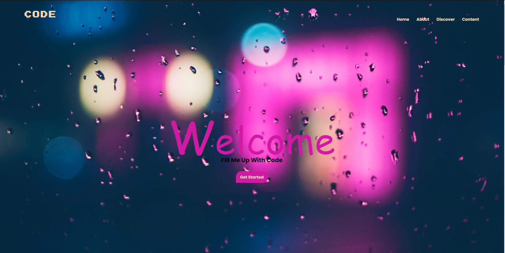

# responsive-scrollreveal-design

A simple one-page site designed using html css and js

## Techs & Materials

<a href ="https://scrollrevealjs.org ">Scroll Reveal</a> <br>
<a href ="https://unsplash.com ">Unsplash</a> for imgs <br>
<a href ="https://fontawesome.com">Fontasesome</a> for icons <br>

## Run Locally

Clone the project

```bash
  git clone https://github.com/CihatKOCAK/responsive-scrollreveal-design.git
```

## Screenshots

You can view the screenshots or watch the <a href ="https://www.youtube.com/watch?v=-WtOK_nEC_0">video</a> below.

# One Page




